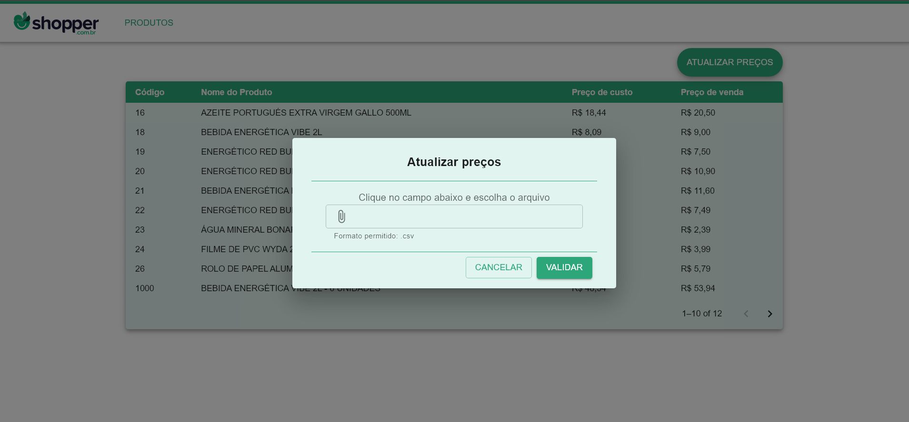
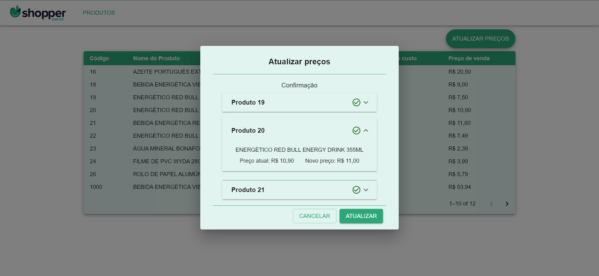
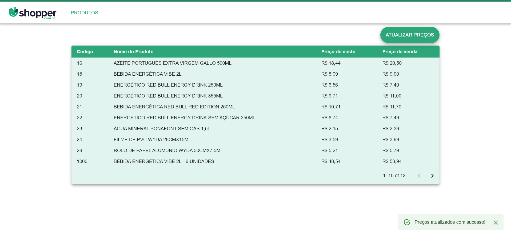
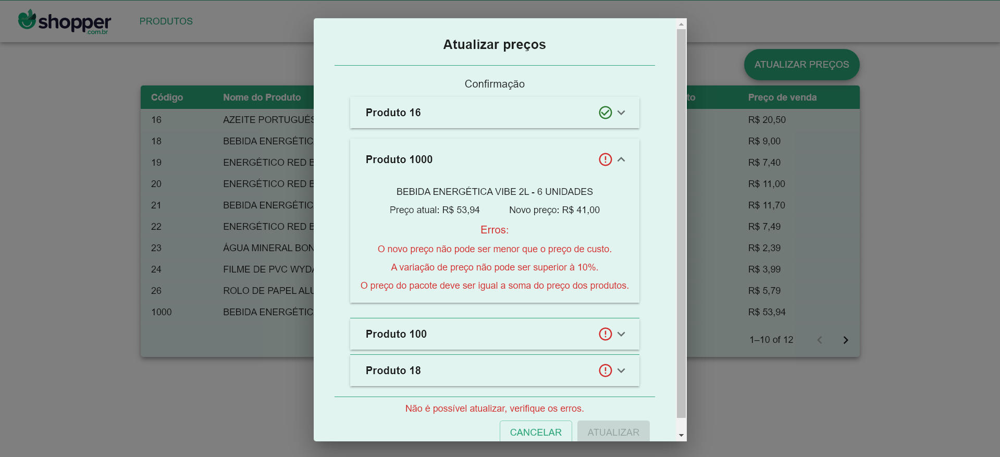
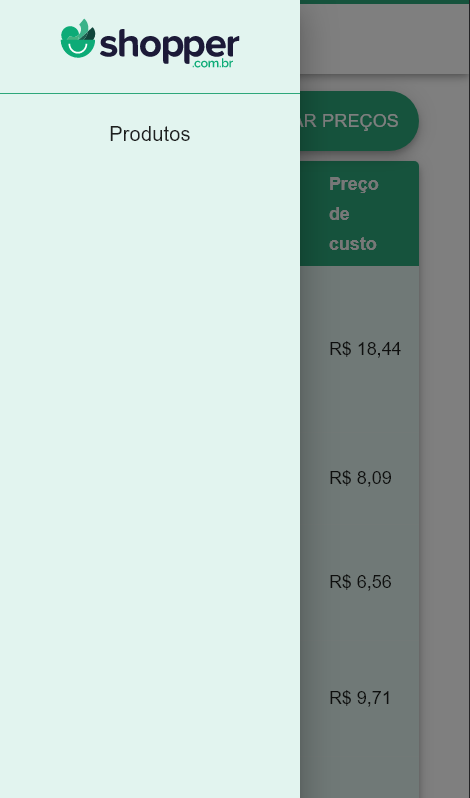
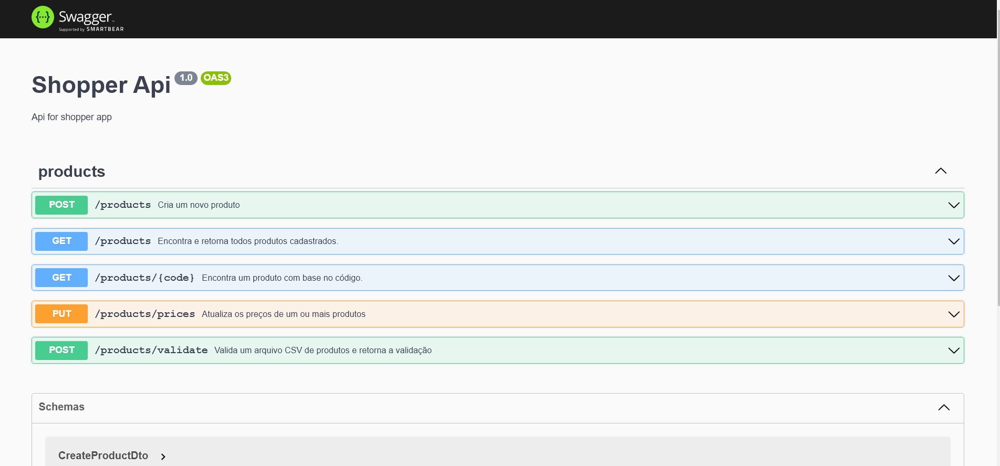
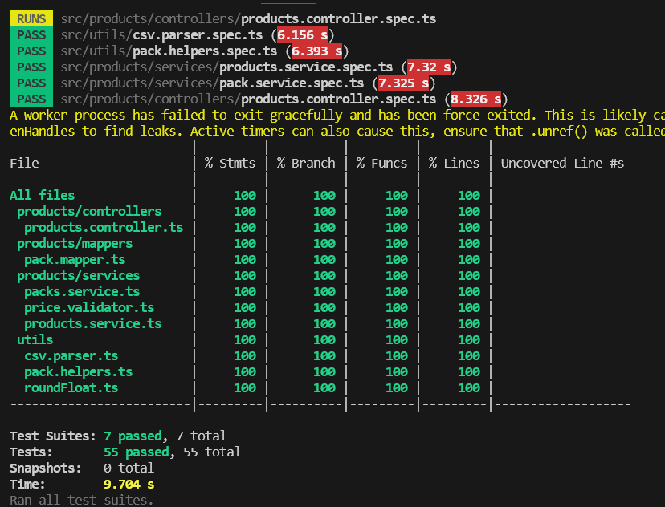

# 🛒 Desafio Shopper

# 🎯Objetivo:

Desenvolver uma aplicação Fullstack capaz de realizar a atualização de preços de produtos por meio de um arquivo .csv, contendo o código e o novo preço de cada produto, além de prover toda a infraestrutura necessária para garantir a efetividade dessa funcionalidade.
   
  
# 🖥️Tecnologias utilizadas:
  

## 📋 Pré-requisitos:

- Docker versão 23.0.5
- Docker compose versão v2.5.0

# 🛠️ Como Utilizar:

1. Clone o repositório para sua máquina utilizando o comando:
  
	`git clone git@github.com:julio-silveira/shopper-challenge.git`

2. Após finalizar o download, abra a pasta **/app** e crie um arquivo **.env** contendo as mesmas variáveis de ambiente presentes no arquivo **.env.example**, ou use os dados do exemplo abaixo:
	<pre><code> DATABASE_URL=mysql://root:root@db:3306/shopper
	PORT=3000
	WEB_PORT=5173
	VITE_API_URL=http://localhost:${PORT}/</code></pre>

3. Abra um terminal na **pasta raiz do repositório** e execute o comando <code>npm run compose:up</code> ou o comando <code>docker-compose up</code> na pasta /app;

4. Aguarde todos os contêineres ficarem de pé;

5. Após isso, você poderá acessar o frontend da aplicação localmente através do localhost na porta escolhida na variável de ambiente WEB_PORT. Por padrão, a página pode ser acessada nesse link: <link>http://localhost:5173</link>

6.A API pode ser acessada também utilizando o localhost na porta escolhida na variável de ambiente PORT, por padrão <link>http://localhost:3000/<link> Já a documentação da API (Swagger) pode ser acessada na rota **/api <link>http://localhost:3000/api</link>.

7. Existem dois arquivos .csv na pasta /data: rightprices.csv, que pode ser utilizado para atualizar produtos com sucesso, e wrongprices.csv, que propositalmente gera alguns erros para facilitar a testagem da aplicação.

## 📷 Preview:

#### Upload form 1 - início

#### Upload form 2 - validado com sucesso

#### Feedback de sucesso ao atualizar produto (snackbar)

#### Upload form 3 - erros

#### Mobile

#### Documentação 1 (Swagger) 

#### Documentação 2 (Swagger) 

#### Cobertura de testes - backend

## 💻 Aplicação:

O objetivo da aplicação é permitir que o usuário carregue um arquivo de precificação contendo o código e o novo preço de cada produto.

Ao clicar no botão "VALIDAR", o sistema lê todo o arquivo e verifica se todos os campos necessários estão preenchidos, se os códigos de produtos informados existem, se os preços estão preenchidos corretamente e se o arquivo respeita as regras definidas no cenário.

Ao final da validação, o sistema exibe as seguintes informações dos produtos que foram enviados: Código, Nome, Preço Atual e Novo Preço. Caso uma ou mais regras de validação tenham sido quebradas, o sistema exibe ao lado de cada produto qual regra foi quebrada.

Se todos os produtos do arquivo foram validados e nenhuma regra foi quebrada, o botão "ATUALIZAR" é habilitado. Ao clicar em "ATUALIZAR", o sistema salva o novo preço no banco de dados e deixa a tela pronta para o envio de um novo arquivo.

A aplicação possui backend dcoumentado com swagger e 100% de cobertura de testes, feitos com Jests, já o frontend está funcional e responsivo.

